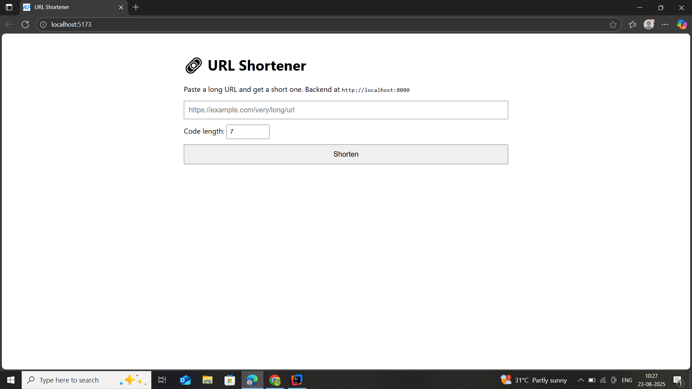
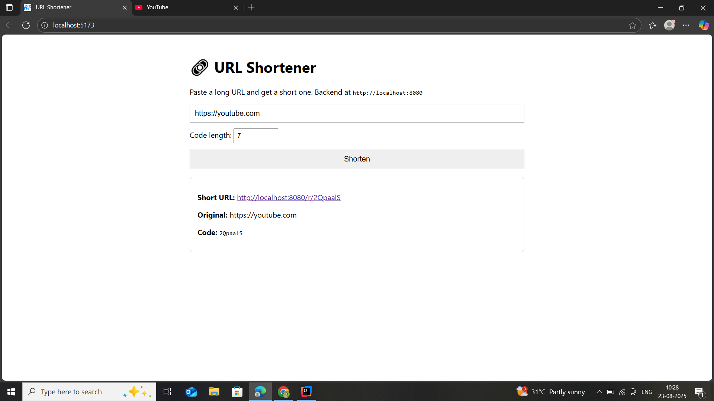
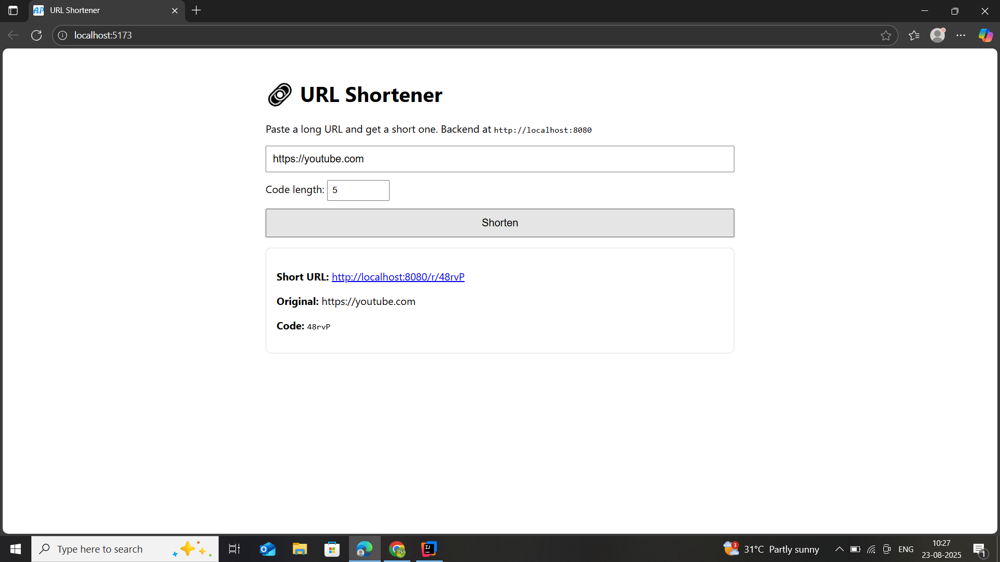
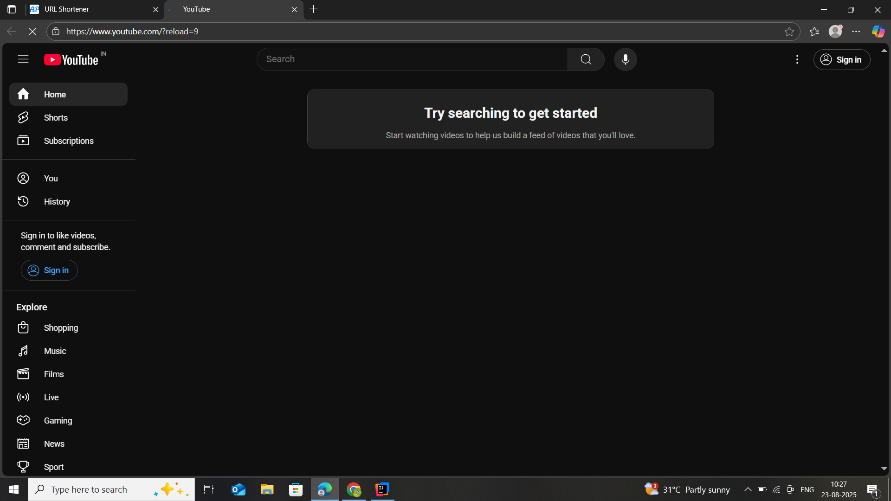
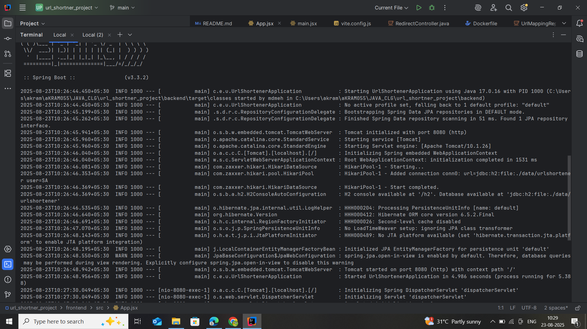

# URL Shortener — Java Full Stack (Spring Boot + React)

A minimal, production-style URL shortener:
- Spring Boot 3 (Java 17), H2 + JPA
- React (Vite) SPA
- Dockerfiles for each service

## Quickstart (Local Dev)

### Backend
```bash
cd backend
mvn spring-boot:run
# API at http://localhost:8080
```

### Frontend
```bash
cd frontend
npm install
npm run dev
# UI at http://localhost:5173
```

### Test
Use the UI, or curl:
```bash
curl -X POST http://localhost:8080/api/shorten -H "Content-Type: application/json"   -d '{ "longUrl": "https://www.google.com/search?q=java+spring+boot", "customLength": 7 }'
```

### Redirect
Open the `shortUrl` returned (e.g., `http://localhost:8080/r/Ab9xYtZ`).

## Docker Compose (optional)
```bash
docker compose up --build
# Frontend at http://localhost:5173 (dev) or http://localhost:8081 (nginx)
# Backend at  http://localhost:8080
```
## 🖼️ Screenshots

### 🔗 Home Page


### ✂️ Shorten URL 7 digits code


### ✂️ Shorten URL 5 digits code


### ↪️ Redirect Example


### backend running interface


## Notes
- H2 is file-based (`./data/urlshortener`), so links persist between runs.
- CORS is enabled for local dev.
- Customize code length via `customLength` (4–12).
- For production, switch H2 to Postgres and put the frontend behind the backend domain.
